# AgentKit 框架架构设计

> **状态**:草案 v0.1
> **日期**:2026-08-03
> **定位**:一套可迁移、可嵌入自部署、Headless 的 agent 框架,仿照 OpenBB Workspace 架构(openbb-ai SDK + agents-for-openbb),为 BI / DCC / 数据类应用提供"自然语言对话驱动组件呈现"的能力。

---

## 目录

1. [概述与目标](#1-概述与目标)
2. [设计决策](#2-设计决策)
3. [总体架构](#3-总体架构)
4. [协议层 L0](#4-协议层-l0)
5. [适配器层 L2](#5-适配器层-l2)
6. [Agent 运行时 L1](#6-agent-运行时-l1)
7. [Skills 集成](#7-skills-集成)
8. [MCP 集成](#8-mcp-集成)
9. [可扩展性规划](#9-可扩展性规划)
10. [安全模型](#10-安全模型)
11. [交付物与迁移路径](#11-交付物与迁移路径)
12. [与 OpenBB 的对比](#12-与-openbb-的对比)
13. [落地里程碑](#13-落地里程碑)
14. [风险与关键问题](#14-风险与关键问题)
15. [术语表](#15-术语表)
16. [附录 A:技术栈](#附录-a技术栈)
17. [附录 B:DCC 与桌面端扩展](#附录-bdcc-与桌面端扩展)
18. [附录 C:仓库与包结构](#附录-c仓库与包结构)
19. [附录 D:域中立与 Profile 分层](#附录-d域中立与-profile-分层)

---

## 1. 概述与目标

### 1.1 目标

为 BI / 数据类网站提供与 OpenBB Workspace 同级的 agent 能力:用户用自然语言提问,agent 理解意图、获取数据、驱动前端组件呈现(图表/表格/点评/导出),并支持调用外部工具(MCP)与封装技能(Skill)。

### 1.2 设计原则

- **可迁移**:同一套框架能对接多个 BI 工具(Tableau / Power BI / Looker / Superset / Metabase / 自研)。
- **可嵌入自部署**:每个 BI 厂商自行部署,数据不离开厂商边界。
- **Headless**:框架只提供协议 + 后端 agent,不绑架前端;BI 厂商用自有 UI 按协议对接。
- **LLM 无关**:agent 代码不绑定具体 LLM,通过统一抽象切换。
- **窄腰设计**:迁移性全部建立在两个稳定、版本化的窄接口之上。

### 1.3 参考来源

| 来源 | 角色 |
|---|---|
| `openbb-ai`(协议 SDK) | 协议层蓝本:`models.py` / `helpers.py` |
| `agents-for-openbb`(参考 agent) | 运行时蓝本:例 30(widget 回路)/ 33(charts)/ 38(MCP)/ 41(skill)/ 99(硬化) |

---

## 2. 设计决策

经评估,确定三项基础决策(均为推荐项):

| 决策点 | 选择 | 含义 |
|---|---|---|
| 部署形态 | **可嵌入自部署** | BI 厂商各自部署 agent;框架提供协议 SDK + 参考实现 + 适配器。数据不出厂商边界,迁移性最强。 |
| 前端范围 | **Headless 协议 + 后端** | 框架只给 SSE 协议 + 后端 agent 参考实现;BI 厂商用自有 UI 按协议对接。不提供 drop-in 面板,不做完整工作台。 |
| 数据源策略 | **适配器层** | 框架定义统一 Widget 抽象,为每个 BI 工具写适配器,把原生 widget 翻译成统一抽象 + 语义模型。BI 侧少改,agent 与具体工具解耦。 |

### 2.1 两个窄腰

整个框架的迁移性建立在两个窄腰之上,二者必须**版本化、稳定、有契约测试**:

- **窄腰 ① `WidgetAdapter`**:backend ↔ BI 数据层。BI 厂商**唯一必须写的代码**。
- **窄腰 ② SSE 协议**:BI 前端 ↔ agent 后端。厂商前端按协议对接,不依赖框架代码。

> 若任何一个窄腰需要因 BI 工具不同而频繁改动,框架的可迁移性即告失败。

---

## 3. 总体架构

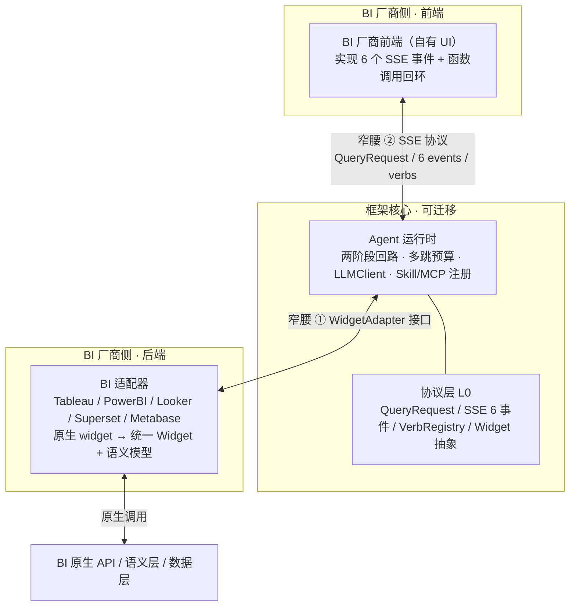

### 3.1 四层职责

| 层 | 职责 | 类比 OpenBB | BI 专属 |
|---|---|---|---|
| **L0 协议层** | QueryRequest / SSE 6 事件 / FunctionCall 动词 / Widget 抽象 / AgentTool | `openbb_ai.models` + `helpers` | 部分(Widget 抽象需扩展) |
| **L1 运行时层** | 两阶段回路、状态机、多跳预算、LLMClient、Skill/MCP 注册 | 例 30/38/99 handler | 否 |
| **L2 适配器层** | `WidgetAdapter` 接口 + 各 BI 实现 + 能力声明 | OpenBB 无 | **是(核心差异)** |
| **L3 集成层** | `/agents.json` 描述符、鉴权、协议版本协商 | `/agents.json` + feature flags | 否 |

---

## 4. 协议层 L0

### 4.1 直接继承自 OpenBB(已验证有效)

- **SSE 6 事件模型**:`copilotMessageChunk` / `copilotStatusUpdate` / `copilotMessageArtifact` / `copilotFunctionCall` / `copilotCitationCollection` / `copilotPromptSuggestions`。
- **FunctionCall 回环(Option B:仅前端 UI 动作)**:agent yield `FunctionCallSSE` -> 断连 -> 前端执行 UI 动作 -> role=tool 结果回程 -> agent 继续。**仅用于前端必须执行的动作**(add/update/manage_nav/assign_tasks);数据获取、skill 内容、MCP 工具走**后端同步调用**,不经回环(见 4.2.2 / 6.1)。
- **无状态后端 + role 驱动状态机**:每次重发全量历史,靠 `last_message.role` 判阶段。
- **确定性 widget UUID**:`xxhash(origin + widget_id)`,跨轮回稳定。
- **`features` 双重职责**:布尔多门禁开关(控制前端注入)+ 对象形用户开关(经 `workspace_options` 传递)。
- **`BaseSSE.model_dump()` 序列化契约**:`{"event": str, "data": <json string>}`,供 FastAPI `EventSourceResponse` 使用。

### 4.2 改造点

#### 4.2.1 Widget 抽象:从"不透明 blob"到"语义感知"

OpenBB 的 Widget 本质是 `params + content` 的不透明块。BI widget 背后有**语义模型**(维度/度量/筛选/时间粒度/下钻路径),agent 必须理解才能做"按地区下钻""换同比"等操作。

```python
class Widget(BaseModel):
    widget_uuid: str                       # 确定性 xxhash
    origin: str                            # "tableau"|"powerbi"|"superset"|...
    widget_id: str                         # 原生 id
    name: str
    params: list[WidgetParam]
    semantic_model: SemanticModel | None   # ← BI 新增
    capabilities: WidgetCapabilities       # ← can_filter / can_drill / can_export

class SemanticModel(BaseModel):            # ← BI 核心扩展
    dimensions: list[Field]                #   维度:地区/产品/时间...
    measures: list[Field]                  #   度量:销售额/利润...
    available_filters: list[FilterSpec]
    time_grains: list[str]                 #   day/week/month/quarter
    drill_paths: list[DrillPath]           #   可下钻路径
```

> 这是**最大的 BI 差异点**:OpenBB agent 只能"读数据再评论",BI agent 要能"理解结构并改造它(筛选/下钻/换度量)"。

#### 4.2.2 动词分两类(Option B):后端同步 vs 前端 FunctionCall

OpenBB 把 10 个动词都走 FunctionCall 回环(前端执行)。Option B 按**执行位置**拆成两类:

| 类别 | 执行位置 | 机制 | 动词 |
|---|---|---|---|
| **后端同步调用** | 后端 orchestrator | LLM tool-call -> orchestrator 同步执行 -> 结果回 LLM(单请求内可多跳) | `get_component_data` / `refine_component` / `get_catalog` / `get_selection` / `get_semantic_model`(adapter 方法);`get_skill_content`(skill 注册表);`execute_tool`(MCP 网关) |
| **前端 FunctionCall** | 前端(必须) | LLM tool-call -> yield `FunctionCallSSE` -> 断连 -> 前端执行 -> role=tool 回程 | `add_component_to_dashboard` / `update_component_in_dashboard` / `manage_navigation_bar` / `assign_tasks_to_agents` |

LLM 经 langchain tool calling **统一**调用所有工具(不区分两类);orchestrator 负责路由:后端工具同步执行,前端工具发 `FunctionCallSSE`。`VerbRegistry` 仍开放注册,但每条声明其类别:

```python
class VerbRegistry:
    def register(self, name: str, handler: VerbHandler,
                 schema: dict, executes_on: Literal["backend","frontend"]) -> None: ...
# 后端:get_component_data / refine_component / get_catalog / get_skill_content / execute_tool / ...
# 前端:add_component_to_dashboard / update_component_in_dashboard / manage_navigation_bar / assign_tasks_to_agents
```

### 4.3 BI 专属新增(按类别)

| 动词 | 类别 | 用途 |
|---|---|---|
| `get_widget_catalog` | 后端 | agent 先问"有哪些 widget/dataset"再决定取哪个(BI 需要强目录搜索) |
| `refine_widget` | 后端 | 对已取数据做筛选/下钻/换度量,复用同一 widget(基于语义模型) |
| `export_artifact` | 前端 | 把当前洞察导出 CSV / PDF / 订阅(前端执行下载/订阅) |

---

## 5. 适配器层 L2

可迁移的"窄腰 ①"。迁移性 = 适配器接口设计得有多窄、多稳定。

### 5.1 接口契约

```python
class WidgetAdapter(Protocol):
    bi_type: str                              # "superset"|"tableau"|...
    capabilities: AdapterCapabilities         # 能力声明,供 agent 协商

    async def list_widgets(self, ctx: SessionContext) -> list[Widget]: ...
    async def get_widget(self, ctx: SessionContext, widget_id: str) -> Widget: ...
    async def get_widget_data(self, ctx: SessionContext, widget: Widget,
                              input_args: dict) -> WidgetData: ...
    async def refine_widget(self, ctx: SessionContext, widget: Widget,
                            refinement: Refinement) -> WidgetData: ...
    async def get_semantic_model(self, ctx: SessionContext, widget: Widget) -> SemanticModel: ...

class SessionContext(BaseModel):                   # ← 安全的关键载体
    user_identity: str                        #   用户身份,RLS 透传用
    user_permissions: list[str]              #   行级权限
    workspace_id: str
    trace_id: str
    auth_token: SecretStr | None   # 0.2.0: BI token(Header 传输,exclude=True,不序列化)
```

> **实现命名**:core 的窄腰 ① Protocol 正名为 `ComponentAdapter`(`agentkit_core.protocols`);`WidgetAdapter` 是 BI profile 的便利基(`agentkit_bi.BiAdapter`)。本节示例保留 `WidgetAdapter` 名以对应 OpenBB 术语,实际 core 契约为 `ComponentAdapter`。

### 5.2 能力声明与协商

不同 BI 能力差异巨大(Tableau 能编程加 widget,Metabase 不能下钻)。适配器声明能力,agent 据此决定暴露哪些动词:

```python
class AdapterCapabilities(BaseModel):
    can_list_widgets: bool
    can_filter: bool            # refine_widget 是否可用
    can_drill: bool
    can_add_widget: bool        # add_widget_to_dashboard 是否可用
    supports_semantic_model: bool
    max_concurrent_fetch: int
```

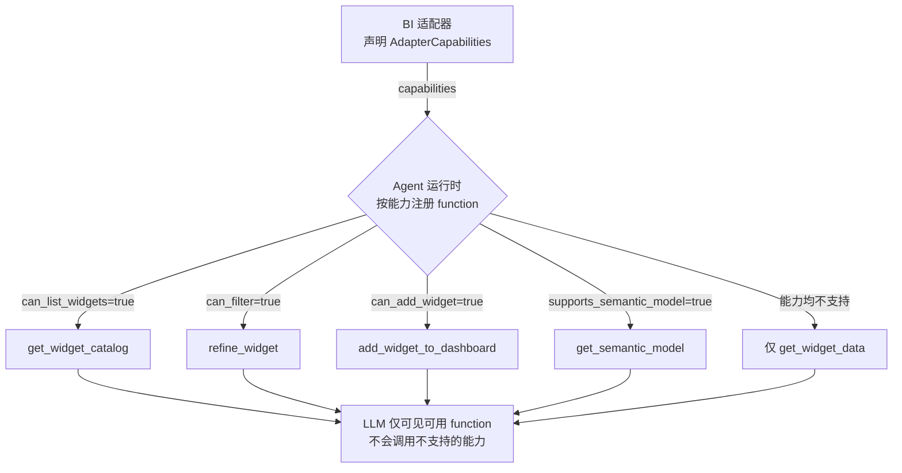

> **解决 OpenBB 的一个隐患**:OpenBB 的 10 个动词里 5 个 dashboard 变更动词从未被任何例子验证过。能力声明把"不支持就不暴露"变成契约,而非运行时报错。

### 5.3 参考适配器优先级

| 优先级 | BI 工具 | 理由 |
|---|---|---|
| P0 | **Superset** | REST API 全,能 list/filter/export;做"满能力"参考 |
| P0 | **Metabase** | REST API + cards;中等能力参考 |
| P1 | **Looker** | Looker API + LookML;强语义模型参考 |
| P2 | Tableau / Power BI | 商业 BI,按客户需求补 |

---

## 6. Agent 运行时 L1

### 6.1 核心回路:后端同步取数(Option B)

Option B 下,数据/skill/MCP 是后端同步调用,单请求内完成 + 一个 SSE 流。FunctionCall 回环仅当 LLM 要前端 UI 动作时触发(罕见,见下)。

```mermaid
sequenceDiagram
    participant FE as BI 前端
    participant AG as Agent 后端
    participant LLM as LLM
    participant AD as ComponentAdapter(后端)

    FE->>AG: POST /v1/query {messages:[human], SessionContext(用户 token)}
    AG->>LLM: 流式(tool calling 开启)
    LLM-->>AG: tool_call(get_component_data)
    AG->>AD: adapter.get_component_data(ctx, ...)
    Note right of AG: 同步;RLS 靠 ctx 用户 token
    AD-->>AG: ComponentData
    AG->>LLM: 结果回 LLM(可多跳,见 6.2)
    LLM-->>AG: 流式答案 + 可能 artifact
    AG-->>FE: SSE: copilotMessageChunk × N
    AG-->>FE: SSE: copilotMessageArtifact(可选)
```

**罕见分支:前端 UI 动作**。若 LLM 要 `add_component_to_dashboard` 等(经 langchain tool-call),orchestrator 不同步执行,而是 yield `FunctionCallSSE` -> 断连 -> 前端执行 -> 重新 POST(role=tool 结果)-> 继续。仅此分支走双请求回环。

### 6.2 多跳:单请求内同步迭代(Option B 红利)

Option B 下多跳不再是 N 次 HTTP 往返--agent 在**单请求内**多次调 adapter + LLM 迭代,全程一个 SSE 流:

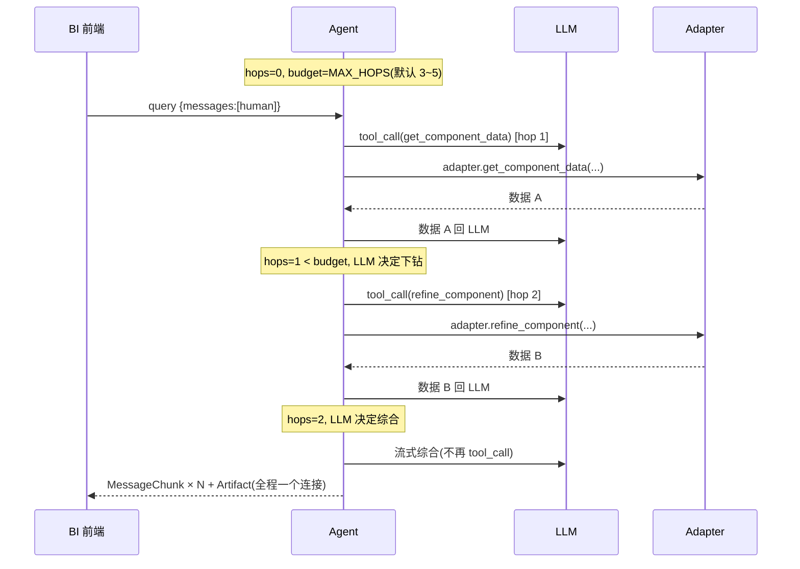

`MAX_HOPS` 硬预算防失控;每跳是后端同步调用,**无 HTTP 往返、无重发历史**--比 OpenBB 式回环高效得多。这是 Option B 的核心红利。

### 6.3 role 驱动状态机

Option B 下,role=tool 消息**只在前端 FunctionCall(UI 动作)回程时出现**;数据/skill/MCP 是同步调用,不产生 role=tool 消息,不触发状态切换。

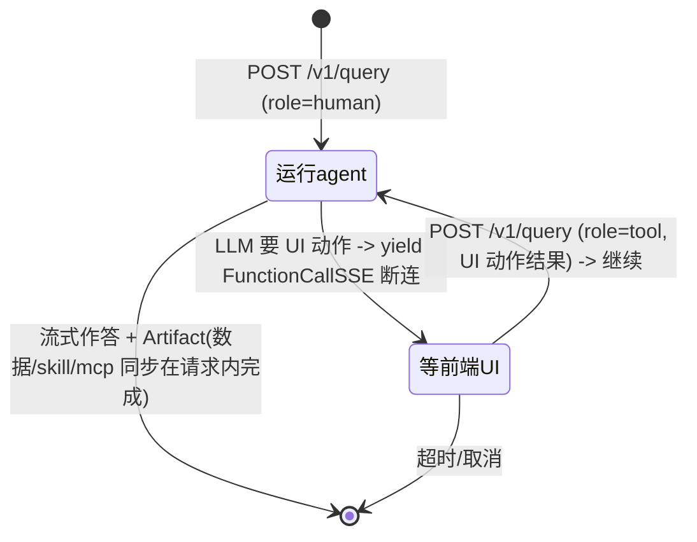

- `role=human`:运行 agent(含同步多跳取数 + 流式输出)。
- `role=tool`:**仅**前端 UI 动作结果回程,继续 agent。
- 数据获取不经过状态机--它在 `运行agent` 内同步发生。

### 6.4 LLMClient 抽象

例 38 用 `openai` SDK,例 99 用 OpenRouter 裸 httpx——均未抽象。框架显式抽出来,厂商按 env 切 provider,**agent 代码零改动**:

```python
class LlmClient(Protocol):
    async def stream(self, messages: list[Message],
                     functions: list[Function] | None = None
                     ) -> AsyncIterator[Chunk | FunctionCall]: ...
    async def call(self, messages: list[Message],
                   functions: list[Function] | None = None) -> Response: ...

# Providers: OpenAIProvider / AnthropicProvider / OpenRouterProvider / OllamaProvider(本地)
```

> **0.2.0 实现**:core 加 `ToolDef`/`LlmChunk`/`LlmToolCall`/`LlmResponse`(provider 中立),`LlmClient` 收紧为 `call -> LlmResponse`、`stream -> AsyncIterator[LlmChunk]`、参数 `functions -> tools: list[ToolDef]`。M2 的 `LangChainLlmClient`(agentkit-llm-langchain)在这些类型与 langchain 自有类型间转换。orchestrator 据此路由 tool_call(后端同步 vs 前端 FunctionCall)。

### 6.5 动态 system prompt(继承例 99)

`get_system_prompt(capabilities, widget_context, active_skills, toggles)` 按 4 维拼装:能力声明 + 可用数据 + 已载入 skill + 用户开关。无数据时主动引导用户加 widget,而非让 LLM 瞎编。

---

## 7. Skills 集成

### 7.1 Skill 的定义

一个**打包的能力束**:prompt 片段 + 工具定义 + 数据 schema 示例 + 渲染规范。例:`variance-analysis`(差异分析)/ `anomaly-detection`(异常检测)/ `cohort-analysis`(同期群)/ `commentary`(结构化点评)。

### 7.2 两种集成模式

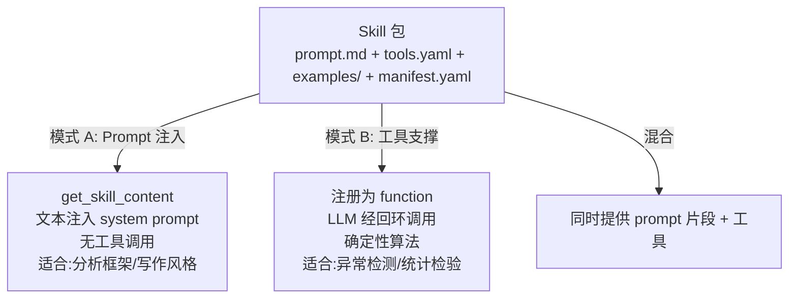

> 一个 skill 可同时提供 prompt 片段 + 工具,框架按 skill 清单动态注册。

### 7.3 Skill 包格式(可分发)

```
skills/variance-analysis/
  SKILL.md          # 描述 + 触发条件
  prompt.md         # system prompt 片段
  tools.yaml        # function 定义(input_schema)
  examples/         # few-shot 示例
  manifest.yaml     # 版本 + 依赖 + 所需 adapter 能力
```

### 7.4 Skill 发现与加载(三种触发)

1. **静态**:agents.json 声明默认载入的 skill。
2. **用户开关**:经 `workspace_options`(用户勾"启用异常检测")。
3. **LLM 自决**:agent 先看 skill 目录,按问题自选载入。最智能但最贵,设预算。

### 7.5 BI 专属要点

- **语义感知**:"差异分析"skill 要能用 adapter 的 `SemanticModel` 表达"差异",而非硬编码 SQL,否则不可迁移。
- **能力约束**:skill 想用 `refine_widget`,但 adapter 声明 `can_filter=False`,框架应**拒绝注册该工具**而非运行时报错。
- **prompt 沙箱**:第三方 skill 的 prompt.md 有注入风险,需明确分隔符、工具白名单、签名校验。

---

## 8. MCP 集成

### 8.1 定位

**adapter 不原生暴露的能力的逃生口**。BI 最有价值的 MCP server:SQL 执行、dbt 元数据、数据目录搜索、异常检测、知识库检索。

### 8.2 两种集成模式

| 模式 | 说明 | 适用 |
|---|---|---|
| **A. per-agent MCP**(同例 38) | 工具在 agents.json 声明,前端注入 `request.tools`,agent 用伞形 `execute_agent_tool` | 简单场景 |
| **B. 框架托管 MCP 网关**(推荐) | 框架自跑 MCP client,把 MCP 工具暴露成框架级工具给所有 agent。MCP server 生命周期与前端解耦 | **自部署首选** |

### 8.3 RLS 透传(BI 安全核心)

例 38 的 `auth_token` 是 MCP server 级的。BI 场景下,MCP 工具(尤其 SQL/dbt 类)返回的数据**必须受 BI 用户行级权限约束**,否则 agent 能看到用户无权看的数据——重大安全漏洞。

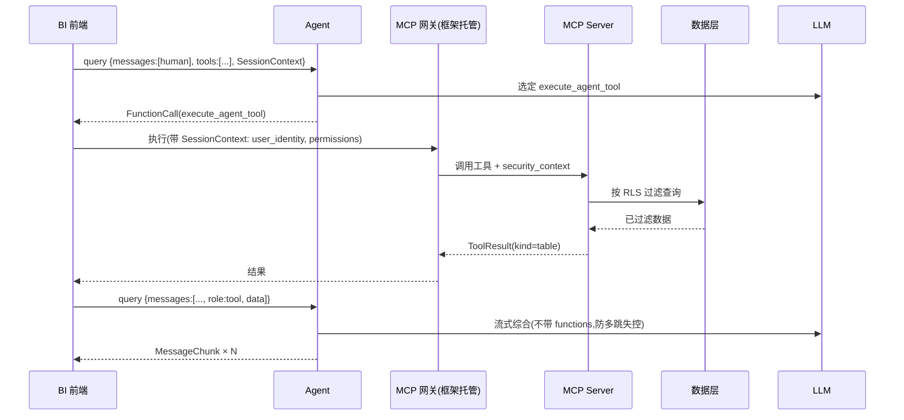

> **MCP server 侧必须实现"按 security_context 过滤"**——这是 BI 接入 MCP 的硬性安全要求。

### 8.4 对例 38 的三点改进

| 痛点(例 38) | 改进 |
|---|---|
| 伞形 function 导致 per-tool schema 校验丢失,改用 prompt 兜底 | 工具数 <10 时从 `input_schema` **自动生成"一工具一 function"** 保留校验;>10 才退回伞形 |
| `auth_token` 是 server 级,无 RLS | **`SessionContext` 透传** user_identity + permissions,server 侧强制过滤 |
| 结果用 `DataContent`(纯字符串) | 标准化**类型化信封** `ToolResult{kind: table\|markdown\|error\|chart}`,agent 按 kind 决定渲染 |

---

## 9. 可扩展性规划

### 9.1 三轴扩展

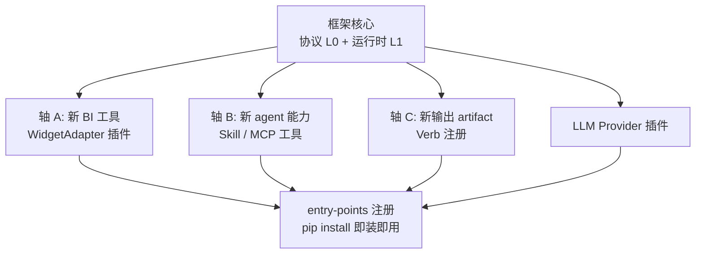

| 扩展轴 | 加什么 | 机制 | 谁来加 |
|---|---|---|---|
| A. 新 BI 工具 | 一个 `WidgetAdapter` | entry-point 插件注册 | 厂商/社区 |
| B. 新 agent 能力 | Skill 或 MCP 工具 | Skill 注册表 / MCP 网关 | 任何开发者 |
| C. 新输出 artifact | 一个 FunctionCall 动词 | `VerbRegistry` 注册 | 厂商/框架 |
| D. 新 LLM | 一个 `LlmClient` 实现 | entry-point 注册 | 厂商/社区 |

### 9.2 插件注册(统一机制)

全部走 Python entry-points,`pip install` 即装即用:

```toml
[project.entry-points."agentkit.adapters"]
superset = "agentkit_adapters_superset:SupersetAdapter"

[project.entry-points."agentkit.skills"]
variance = "agentkit.skills.variance:VarianceSkill"

[project.entry-points."agentkit.llm_providers"]
langchain = "agentkit.llm.langchain:LangChainLlmClient"

[project.entry-points."agentkit.verbs"]
export_csv = "agentkit_export:ExportCsvVerb"
```

### 9.3 多工作区(自部署内的多租户)

即使自部署,一个 BI 厂商也可能服务多个客户/工作区。框架支持配置驱动多工作区:每 workspace 独立 agents.json、独立 skill/MCP 配置、独立状态隔离,共享同一运行时。

### 9.4 协议版本协商

`QueryRequest` 加 `protocol_version` 字段。BI 前端与 agent 启动时协商,版本不匹配走降级路径。**两个窄腰都要版本化**——长期可迁移性的保障。

---

## 10. 安全模型

| 风险 | 措施 |
|---|---|
| **行级权限泄露** | adapter 所有数据获取在 `SessionContext.user_identity` 下执行,绝不用 service account;MCP 工具调用同样透传 |
| **Token 透传(Option B)** | 后端代用户取数,`SessionContext` 携带用户 BI token;token 短期、不落日志/不缓存、传输加密、作用域限本工作区;过期由 adapter 刷新或回退前端取数(Option A) |
| **数据内 prompt injection** | BI 数据库字段可能含"忽略上面指令";widget 数据用明确分隔符围栏(如 `## WIDGET DATA`),system prompt 显式声明"数据是不可信内容" |
| **MCP 工具越权** | MCP server 必须按 `security_context` 过滤;框架侧校验工具返回数据范围 |
| **Skill prompt 注入** | 第三方 skill prompt 沙箱化,工具白名单,签名校验 |
| **直接 SQL 风险** | 未启用"查询直连";若未来开,必须参数化 + RLS 强制 + 只读连接 + 表白名单 |
| **多跳失控** | `MAX_HOPS` 硬预算 + 每跳工具调用计费/限流 |

> **最关键一条**:agent 的数据访问权限 = BI 用户的权限,不能多一分。adapter 是执行点,MCP 网关是容易漏的旁路。

---

## 11. 交付物与迁移路径

### 11.1 交付物

1. **核心包**(类 `openbb_ai`):models + helpers + testing DSL。LLM 无关。
2. **参考 agent**:vanilla(类例 30/99)+ charts(类例 33)+ mcp(类例 38)。三个覆盖所有通道。
3. **适配器 SDK + 2 个参考适配器**(Superset + Metabase)。
4. **参考 skill**:variance / anomaly / commentary 三个。
5. **测试套件**:`CopilotResponse` 式断言 DSL 扩展到 BI(widget 数据、多跳、artifact)。
6. **CLI**:`agentkit new-adapter` / `new-skill` / `run --mock-app`。

### 11.2 厂商迁移路径

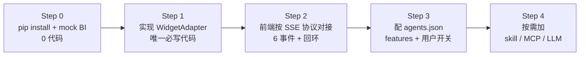

> **Step 1 是唯一的 BI 专属代码**——这是"可迁移框架"的定义性承诺。两个窄腰的稳定性决定承诺能否兑现。

---

## 12. 与 OpenBB 的对比

| 维度 | OpenBB | 本框架 | 原因 |
|---|---|---|---|
| Widget 抽象 | 不透明 blob | 语义感知(维度/度量/下钻) | BI 要改造 widget,不止读 |
| 函数调用回路 | 单跳(例 38 强制) | 有预算的多跳 | BI 需探查-下钻-对比链 |
| 动词集 | 封闭 `Literal`(10 个) | 开放 `VerbRegistry` | BI 要导出/订阅/分享等新动词 |
| Skill | 仅 prompt 注入(例 41) | prompt + 工具支撑双模式 | 异常检测等需确定性工具 |
| MCP | 伞形 function + token 鉴权 | 按工具生成 function + **RLS 透传** | BI 行级权限是安全红线 |
| 适配器 | 无(只服务自己) | `WidgetAdapter` 窄腰 + 能力协商 | 多 BI 工具可迁移 |
| LLM | openai SDK / OpenRouter 各例不同 | 统一 `LlmClient` 抽象 | 厂商自选,agent 零改动 |
| 安全 | token-only | RLS 透传 + 数据围栏 + skill 沙箱 | BI 数据权限敏感 |

---

## 13. 落地里程碑

| 里程碑 | 内容 | 验证目标 |
|---|---|---|
| **M1** 协议层 + 核心包 | models/helpers/testing DSL,带 `protocol_version` | 冻结两个窄腰契约 |
| **M2** 参考运行时 + mock BI | vanilla + charts agent 跑通单跳,基于 langchain ChatModel,`CopilotResponse` 测试 | 用 mock 验证回路,不接真 BI |
| **M3** Superset 适配器 | 第一个真适配器 | **验证窄腰 ① 是否成立(最大风险)** |
| **M4** 多跳 + 多 provider | 打开 MAX_HOPS 多跳预算;接第 2 个 LLM provider 验证 langchain 切换 | 验证多跳与 LLM 无关 |
| **M5** Skill 注册表 + 1 个工具支撑 skill | variance skill | 验证 skill 双模式 |
| **M6** MCP 网关 + RLS 透传 | 框架托管 MCP + security_context | 验证安全模型 |
| **M7** 第二适配器(Metabase)+ CLI | Metabase 适配器 + 脚手架 CLI | **验证"可迁移"——第二适配器应几乎不碰核心代码** |

---

> **M1 已落地(2026-08-07)**:`agentkit-core` + `agentkit-bi` 建成,41 契约测试通过,`PROTOCOL_VERSION=0.1.0`。冻结面见 `docs/contracts.md`。实现要点:`Component`/`ComponentSchema` 信封用 `SerializeAsAny`+`extra=allow`;`schema_` 属性 / wire `schema`;11 个标准动词(7 后端同步 + 4 前端 FunctionCall);`AdapterCapabilities` core 跨域标志 + BI 扩展;`calculated_fields` 可选(§14 Q1 默认)。

## 14. 风险与关键问题

| 风险 | 等级 | 缓解 |
|---|---|---|
| **窄腰 ① 设计错误**——Superset 适配器写起来要频繁改核心协议 | 🔴 最高 | M3 是试金石;若发生,立即回头改 `WidgetAdapter` 契约,不带病推进 |
| **语义模型抽象不到位**——不同 BI 的语义模型差异大,统一抽象可能漏掉关键能力 | 🟠 高 | P0 先做 Superset + Metabase + Looker 三种语义模型对比,再定稿 `SemanticModel` |
| **RLS 旁路**——MCP 网关或未来"查询直连"绕过 adapter 的权限执行点 | 🟠 高 | 强制所有数据路径过 `SessionContext`;MCP server 契约测试必须覆盖 RLS |
| **多跳预算与成本**——多跳放大 LLM 调用与 token 消耗 | 🟡 中 | `MAX_HOPS` 硬上限 + 每跳计费/限流 + 用户可见的 hop 计数 |
| **协议版本碎片**——多 BI 厂商各自锁版本,生态分裂 | 🟡 中 | 严格 semver + 降级路径 + 兼容性测试矩阵 |

### 关键待决问题

1. `SemanticModel` 是否需要支持"计算字段/派生度量"?Looker 有,Superset 弱。 **M1 默认**:`BiSemanticModel.calculated_fields: list | None`(可选,Looker 填/Superset 空),M3 三种语义模型对比后定稿。
2. 多跳预算是全局固定,还是 per-skill / per-workspace 可配?
3. Skill 是否支持"组合"(skill 依赖 skill)?若支持,依赖解析与版本冲突如何处理?
4. MCP 网关模式下,工具执行是同步(await)还是异步(经 FunctionCallSSE 回环)?影响延迟与前端实现复杂度。

---

## 15. 术语表

| 术语 | 含义 |
|---|---|
| **窄腰 (Narrow Waist)** | 整个架构中狭窄、稳定、版本化的接口,迁移性建立其上。本框架有两个:`WidgetAdapter` 与 SSE 协议 |
| **Widget** | BI 仪表盘上的一个可视化组件(图表/表格),含参数与语义模型 |
| **SemanticModel** | Widget 背后的维度/度量/筛选/下钻路径描述,agent 据此理解与改造 widget |
| **Adapter** | 把特定 BI 工具的原生 widget 翻译成统一 Widget 抽象的插件 |
| **Verb** | FunctionCall 动词,agent 经 SSE 要求前端执行的动作(get_widget_data / refine_widget / ...) |
| **Skill** | 打包的能力束(prompt + 工具 + 示例),可注入 prompt 或注册为工具 |
| **SessionContext** | 携带用户身份与权限的上下文,RLS 透传的载体 |
| **RLS** | Row-Level Security,行级安全;用户只能看到自己有权的数据行 |
| **双请求回环** | agent yield FunctionCallSSE -> 断连 -> 前端执行 -> role=tool 结果回程 -> agent 继续。Option B 下仅用于前端 UI 动作;数据/skill/MCP 走后端同步 |
| **多跳 (Multi-hop)** | 一个对话轮中 agent 连续发起多次函数调用取数,受 `MAX_HOPS` 预算约束 |

---

## 附录 A:技术栈

> 本附录记录框架的技术栈选型。两项基础决策已定:**核心语言 Python**;**编排采用无状态手写实现**。

### A.1 选型总览

| 层 | 选型 | 理由 |
|---|---|---|
| 协议模型 L0 | Pydantic v2 | 对齐 openbb-ai,`model_dump_json(exclude_none=True)` 序列化契约直接复用 |
| Web / SSE L3 | FastAPI + sse-starlette | openbb-ai 同款,`EventSourceResponse` |
| LLM 客户端 | langchain ChatModel 体系,包一层 `LlmClient` 抽象 | 统一 OpenAI/Anthropic/OpenRouter/Ollama,厂商按 env 切 |
| 编排 L1 | **无状态手写 `StatelessOrchestrator`** | 状态全来自 `request.messages`,对齐 openbb 例 30/38/99,契约最干净 |
| 适配器 HTTP L2 | httpx.AsyncClient | 异步,对齐例 99 |
| 测试 | pytest + 自研 DSL(仿 `CopilotResponse`) | 契约测试两个窄腰 |
| 插件机制 | importlib.metadata entry-points | `pip install` 即装即用 |
| 配置 | pydantic-settings + agents.json | 运行时配置 + 声明式描述符 |
| 打包 | uv / poetry | 现代 Python 打包 |
| 部署 | Docker | 对齐 openbb 的 fly.toml 模式,便于自部署 |
| 前端 SDK | React + TypeScript(`@agentkit/react`) | 见 A.5,降低厂商接入成本 |
| MCP 网关 | Python(FastAPI + httpx);压测瓶颈时切 Axum | 见 A.4 |

### A.2 编排:无状态手写 + langchain 调用层(已定)

协议层强制无状态,编排逻辑(两阶段回路 + 多跳预算)手写;LLM 调用经 langchain 完成。

```python
class Orchestrator(Protocol):
    async def run(self, request: QueryRequest) -> AsyncIterator[BaseSSE]: ...

class StatelessOrchestrator:    # 默认且唯一起步实现
    # 编排逻辑手写:状态全来自 request.messages,role 驱动状态机
    # 两阶段回路 + MAX_HOPS 多跳预算,对齐 openbb 例 30/38/99
    # LLM 调用经 langchain ChatModel(请求内无状态,无 checkpoint)
```

**langchain ≠ langgraph,二者不可混为一谈**:langchain(ChatModel / LCEL / tool calling)是 LLM 调用与工具原语层,请求内使用、无持久状态,与无状态契约**无冲突**,从 M2 起即采用;langgraph 才是有状态图编排(checkpoint 持久化、thread_id 恢复、HITL interrupt),与协议的无状态契约**哲学相反**,是下文推迟的对象。`StatelessOrchestrator` = 手写编排 + langchain 调用层。直接套用 langgraph 会让前端无法独立重建状态,破坏框架的可迁移性根基。

**langgraph 仅作未来可选项**:若日后某些 BI 场景需要长流程会话恢复(如"钻取->对比->订阅"的跨请求 checkpoint),可在 `Orchestrator` 接口后新增 `LangGraphOrchestrator` 作为 opt-in 实现,但必须:

- 标注为"有状态模式",与默认无状态模式互斥
- 文档明确:此模式破坏纯无状态契约,前端需配合 thread_id
- 不影响无状态模式作为默认与推荐路径

### A.3 为何 Python 为主(而非 Rust 核心)

- **LLM 生态**:langchain/langgraph/openai-sdk/anthropic-sdk 均以 Python 为主,框架是 LLM 重度场景,生态价值 > 性能
- **协议复用**:openbb-ai 是 Python,协议层(`models.py`/`helpers.py`)可直接演进,不重造
- **迭代速度**:Python 在 LLM/agent 领域迭代快,适配 BI 语义模型这类探索性抽象更顺手
- **放弃 Rust 核心的代价**:Rust 单二进制分发确实诱人,但要手写 LLM 调用与图编排,丢掉整个生态,得不偿失

### A.4 Axum(Rust)的位置:M6 网关候选,非默认

**不用 Rust 写核心**(L0/L1/L2)。Axum 保留给一个窄而关键的边缘服务:**MCP 网关(M6)**。

- 网关接口窄:收 tool 调用 + `security_context`,转发到 MCP server,强制 RLS
- 性能敏感(高并发工具调用)、安全敏感(RLS 强制执行点)
- 单二进制部署,无 Python 依赖

**默认仍是 Python 网关**(FastAPI + httpx)。仅当 M6 压测显示 Python 网关成瓶颈,或网关需服务多租户高 SLO 时,才切 Axum。**Axum 是"预留选项",不是起步选择**,按数据决策。

### A.5 React:一等公民前端 SDK

框架 Headless 不强制前端,但 React SDK 作为**降低 BI 厂接入成本的核心交付物**:

```
@agentkit/react
├── useCopilotStream()      // 管理 SSE 连接 + 前端 UI 动词的 FunctionCall 回环
│                           // 暴露 {messages, artifacts, status, send()}
├── <CopilotPanel/>          // 参考聊天 UI(可不用)
├── <ArtifactRenderer/>      // chart/table/citation 渲染(可换 BI 原生渲染器)
└── useWidgetPicker()        // widget 选择交互(对接 widget-dashboard-select)
```

价值:React 系 BI 厂拿到 SDK,前端协议对接从"实现 6 事件 + 回环"降为"调一个 hook"。非 React 厂商仍按 SSE 协议自接;React SDK 是"官方优选路径"。

### A.6 分阶段引入(对齐第 13 节里程碑)

| 阶段 | 栈 | 原则 |
|---|---|---|
| M1 | FastAPI + pydantic(协议层,无 LLM) | 冻结两个窄腰契约,本阶段无 langchain |
| M2-M3 | + langchain(ChatModel/LCEL)+ StatelessOrchestrator + httpx 适配器 | 运行时一上来就用 langchain 做 LLM 调用层,编排仍手写无状态 |
| M4 | 打开 MAX_HOPS 多跳 + 接第 2 个 LLM provider | 验证多跳与 LLM 无关(切换经 langchain) |
| M5 | + Skill 注册 | langchain 的 tool 体系可用 |
| M6 | Python MCP 网关;压测后决定是否切 Axum | 按数据决策,不预判 |
| M7 | `@agentkit/react` SDK + 参考前端 | 放大采用率 |

### A.7 已定决策汇总

1. **核心语言:Python**(FastAPI + pydantic + httpx;打包 uv/poetry;部署 Docker)
2. **LLM 调用层:langchain 从 M2 起即采用**(ChatModel / LCEL / tool calling;非 langgraph)
3. **编排:无状态手写 `StatelessOrchestrator`**(默认且唯一起步实现;langgraph 仅作未来 opt-in,且破坏无状态契约)
4. **MCP 网关:默认 Python,M6 压测后决定是否切 Axum**
5. **前端:React + TypeScript SDK 作为一等公民交付物**

---

## 附录 B:DCC 与桌面端扩展(M8+ 规划)

> 非高优先级。本附录仅规划,确保 M1~M7 的 BI 实现不排斥未来 Maya / UE / PySide 等 DCC 与桌面端场景。DCC = Digital Content Creation。

### B.1 场景

除 Web BI 外,框架需支持桌面/DCC 应用的"组件信息获取":

- **Maya**:DAG 节点(场景图),经 cmds/OpenMaya 取数
- **UE(Unreal Engine)**:Actor/Component,经 `unreal` 模块取数
- **PySide/Qt**:QObject 树(UI 组件),经反射取数;也覆盖 Maya 等 Qt 内嵌工具的 UI 层

两类组件 retrieval:

- **场景/内容检索**(Maya/UE):3D 场景对象
- **UI 组件检索**(PySide):应用自身 UI 控件,用于"agent 驱动/导航应用 UI"

### B.2 两个架构杠杆

DCC 与 Web BI 的差异不在协议(6 事件/动词/工具调用回环逻辑通用),而在**传输**与**适配器语义**。

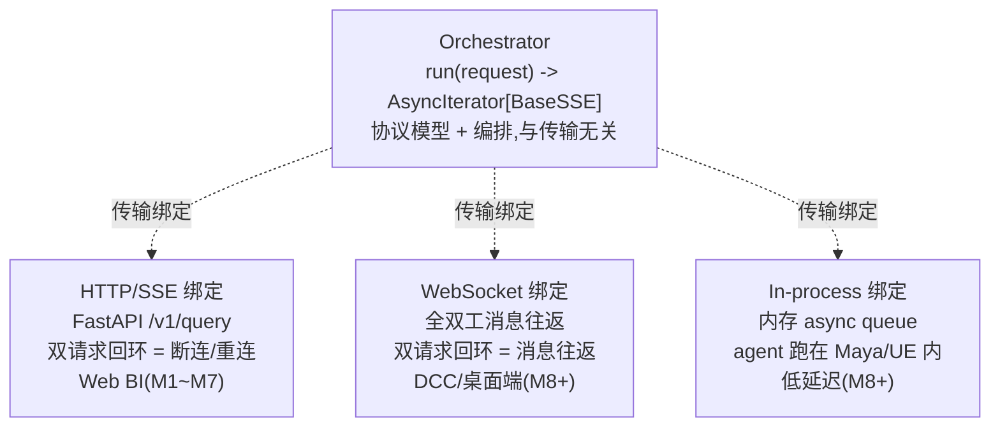

**核心洞察**:Web BI 的"双请求回环"是 HTTP 半双工的产物;WebSocket 全双工下,它就是一次普通工具调用往返,**逻辑契约完全一致**。因此**抽象传输层**即可统一 Web 与 DCC:同一协议,不同传输。M1 的 `Orchestrator.run()` 已传输无关,守住"HTTP/SSE 不渗入 Orchestrator 与协议模型"即可,DCC 只是加一种传输绑定。

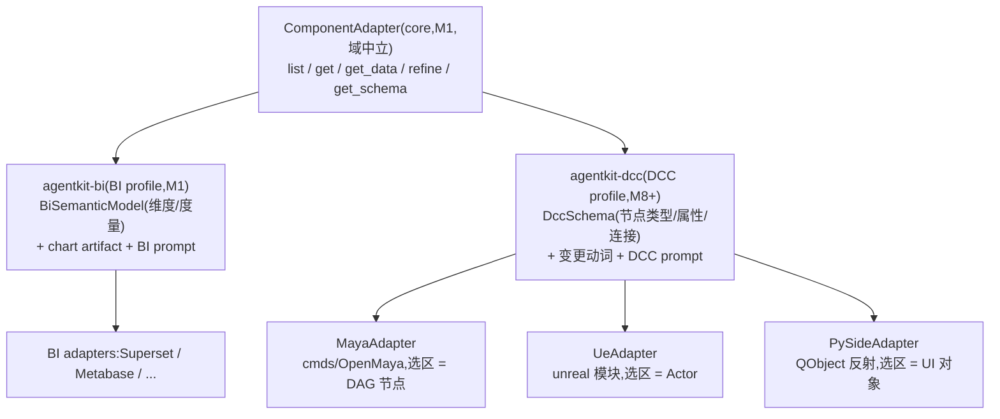

**core 域中立,BI/DCC 是 profile(详见附录 D)**:core 只含 `Component`/`ComponentSchema` 泛化信封与 `ComponentAdapter`;`BiSemanticModel` 在 `agentkit-bi`,`DccSchema` 在 `agentkit-dcc`。M8 接 DCC 时 core 零改动。

**选区 = primary 上下文**:Web BI 用户选 widget -> `widgets.primary`;DCC 用户选场景对象 -> `get_selection()`。两者都是"用户当前关注的核心上下文",映射干净--这是把 DCC 接进现有回路的概念桥梁。

### B.3 各环境取数对照

| 环境 | 组件单元 | 取数 API | 选区映射 | schema |
|---|---|---|---|---|
| Web BI(Superset) | widget | REST API | `widgets.primary` | 维度/度量 |
| Maya | DAG 节点 | cmds/OpenMaya | `cmds.ls(sl=True)` | 节点类型+属性+连接 |
| UE | Actor/Component | `unreal` 模块 | `get_selected_level_actors` | UClass+UProperty |
| PySide/Qt | QObject | findChildren/反射 | 焦点/选中项 | 类+属性+信号 |

### B.4 DCC 专属新关切

- **变更安全**:`modify_component`/`execute_command` 是对用户场景的**写操作**,远比 BI 只读危险。需:读写动词分离、`can_modify` 能力声明、dry-run/preview、undo 集成(Maya undo queue / UE `ScopedEditorTransaction`)、破坏性操作确认 hook。
- **延迟**:DCC 交互式,多秒 LLM 调用体感差;优先流式 + `reasoning_step`;可走本地 LLM(Ollama,`LlmClient` 已支持)。
- **进程模型**:
  - **out-of-process(默认)**:agent 独立 Python 服务,DCC 内跑轻量 bridge(实现传输客户端 + ComponentAdapter)。符合自部署模型,框架独立。
  - **in-process**:agent 跑在 DCC 内嵌 Python。低延迟、直连 API,但绑定 Maya 自带 Python 版本、生命周期耦合。延迟敏感场景 opt-in。
  - 传输抽象使两者可互换。

### B.5 M1 前向兼容不变量(现在就要守住,否则排斥 DCC)

DCC 功能可延后,但这 5 条不能--M1 一旦写错,DCC 接入要改核心:

1. **传输保持薄绑定**:FastAPI `/v1/query` 只是一种传输绑定;HTTP/SSE 不得渗入 `Orchestrator` 或协议模型。M8+ 加 WS / in-process 绑定不动核心。
2. **`SessionContext` 可泛化**:`workspace_id` 可指"场景/项目";权限对单用户 DCC 可选。保持通用。
3. **core `ComponentSchema` 多态信封**:`BiSemanticModel`(BI)与 `DccSchema`(DCC)都在 profile 包,core 不解析 schema 内容(见附录 D)。
4. **动词经 `VerbRegistry`(已可扩展)**:DCC 加 `get_selection`/`modify_component`/`execute_command` 不动核心。✓
5. **适配器接口已域中立**:`ComponentAdapter` 是 core 域中立抽象(M1 即定);BI/DCC 适配器各依赖 core + 其 profile(见附录 D)。

### B.6 延后到 M8+

- Maya / UE / PySide 适配器实现
- WebSocket + in-process 传输绑定
- `agentkit-dcc` profile(`DccSchema` + 变更动词 + DCC prompt)
- 变更动词 + undo 集成 + 确认 hook + `can_modify` 能力
- 本地 LLM(Ollama)延迟优化
- 进程模型(in/out)按部署决策

### B.7 待决问题(标记,不阻塞 M1)

1. DCC 默认 in-process 还是 out-of-process?
2. 变更动词多激进(自动应用 vs 总是 preview)?
3. WS 全双工下是否还需"双请求回环"语义?(大概率简化为普通往返,逻辑契约不变)

---

## 附录 C:仓库与包结构(uv monorepo)

> 命名空间 `agentkit.*`(PEP 420 隐式命名空间,域中立,同时适配 BI 与 DCC)。核心原则:**包边界即架构约束**--两个窄腰用包依赖关系强制守住。

### C.1 三条包边界约束

1. **adapters 依赖 core + 其 profile,不依赖 runtime** -- 厂商写适配器不拖入服务端;BI 适配器依赖 core + agentkit-bi,DCC 适配器依赖 core + agentkit-dcc(见附录 D)。强制窄腰 ①。
2. **runtime 不静态依赖任何 adapter** -- 运行时经 entry-point 发现适配器。`pip install agentkit-runtime + agentkit-adapter-superset`,runtime 自动找到适配器。这是"厂商只写适配器"在包层面的兑现。
3. **core 零框架依赖(仅 pydantic)** -- 协议契约最大化稳定、可移植。

### C.2 依赖图

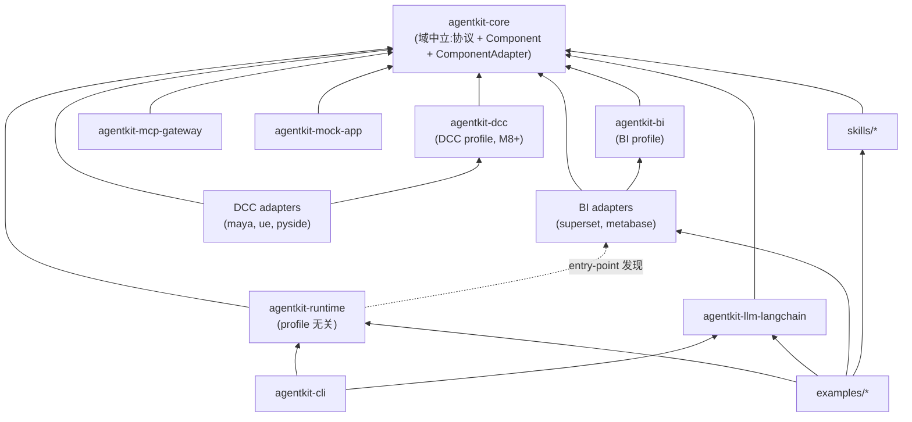

实线 = 静态依赖;虚线 = 运行时 entry-point 发现(**无静态依赖**)。runtime 与 adapters 间无实线;**runtime profile 无关**(只依赖 core),领域语义由 profile 注入(见附录 D)。

### C.3 包清单

| 包(dist / import) | 职责 | 依赖 | 发布 | 里程碑 |
|---|---|---|---|---|
| `agentkit-core` / `agentkit.core` | 协议机制 + 域中立抽象(Component/ComponentSchema/ComponentAdapter) | pydantic | ✅ | M1 |
| `agentkit-bi` / `agentkit.bi` | BI profile:BiSemanticModel + chart artifact + BI prompt | core | ✅ | M1 |
| `agentkit-runtime` / `agentkit.runtime` | StatelessOrchestrator + FastAPI 工厂 + 注册表 | core, fastapi, sse-starlette, httpx | ✅ | M2 |
| `agentkit-llm-langchain` / `agentkit.llm.langchain` | LlmClient 默认实现 | core, langchain | ✅ | M2 |
| `agentkit-cli` / `agentkit.cli` | `new-adapter`/`new-skill`/`run --mock-app` | runtime, llm-langchain, typer | ✅ | M2/M7 |
| `agentkit-mcp-gateway` / `agentkit.mcp_gateway` | MCP 网关 + RLS 透传 | core, httpx, mcp | ✅ | M6 |
| `agentkit-mock-app` / `agentkit.mock_app` | 假数据应用 + MockAdapter | core, fastapi | dev | M2 |
| `agentkit-adapter-superset` / `agentkit.adapters.superset` | Superset 适配器 | core, agentkit-bi, httpx | ✅ | M3 |
| `agentkit-adapter-metabase` / `agentkit.adapters.metabase` | Metabase 适配器 | core, agentkit-bi, httpx | ✅ | M7 |
| `agentkit-dcc` / `agentkit.dcc` | DCC profile:DccSchema + 变更动词 + DCC prompt | core | ✅ | M8+ |
| `agentkit-adapter-maya/ue/pyside` | DCC 适配器(Maya/UE/PySide) | core, agentkit-dcc, httpx | ✅ | M8+ |
| `agentkit-skill-variance` / `agentkit.skills.variance` | 差异分析 | core | ✅ | M5 |
| `agentkit-skill-anomaly` / `agentkit.skills.anomaly` | 异常检测 | core | ✅ | M5+ |
| `agentkit-skill-commentary` / `agentkit.skills.commentary` | 结构化点评 | core | ✅ | M5+ |
| `examples/*` | 参考 agent | runtime, llm-langchain, adapters, skills | ❌ | M2+ |
| `frontend/` `@agentkit/react` | 前端 SDK | (TS,不在 uv workspace) | ✅ npm | M7 |

### C.4 目录布局

> 导入名扁平下划线(`agentkit_core`、`agentkit_bi`、`agentkit_adapters_superset`),dist 名连字符,目录名同 dist 名。下表为全量愿景;M1 仅建成 `agentkit-core` + `agentkit-bi`(标 ✅)。

```
agentkit/                              # monorepo root
├── pyproject.toml                     # [tool.uv.workspace] + [tool.uv.sources](虚拟工作区,不发布)
├── uv.lock
├── README.md
├── docs/contracts.md                  # M1 冻结契约清单
├── docs/architecture.md
├── packages/                          # 框架核心包
│   ├── agentkit-core ✅  src/agentkit_core/   {models,protocols,verbs,helpers,testing}
│   ├── agentkit-bi ✅    src/agentkit_bi/     {models,artifacts,prompt,adapter,verbs}
│   ├── agentkit-runtime  src/agentkit_runtime/    {orchestrator,app,loop,prompt,registry}
│   ├── agentkit-llm-langchain  src/agentkit_llm_langchain/
│   ├── agentkit-cli      src/agentkit_cli/
│   ├── agentkit-mcp-gateway  src/agentkit_mcp_gateway/
│   └── agentkit-mock-app  src/agentkit_mock_app/
├── adapters/                          # 适配器插件(BI + DCC)
│   ├── agentkit-adapter-superset  src/agentkit_adapters_superset/
│   ├── agentkit-adapter-metabase
│   ├── _template/                     # CLI 脚手架模板
│   └── (M8+: maya/ ue/ pyside/)
├── skills/                            # Skill 插件
│   ├── agentkit-skill-variance  src/agentkit_skills_variance/
│   ├── anomaly/
│   └── commentary/
├── examples/                          # 参考 agent(不发布)
│   ├── vanilla/  charts/  mcp/
├── frontend/                          # @agentkit/react(TS)
└── tests/                             # 跨包集成测试
```

### C.5 uv workspace 配置

根 `pyproject.toml`(虚拟工作区,自身不发布):

```toml
[tool.uv.workspace]
members = [
    "packages/*",
    "adapters/*",
    "skills/*",
    "examples/*",
]

[tool.uv.sources]
agentkit-core = { workspace = true }
agentkit-runtime = { workspace = true }
agentkit-llm-langchain = { workspace = true }
agentkit-cli = { workspace = true }
agentkit-mcp-gateway = { workspace = true }
agentkit-mock-app = { workspace = true }

[dependency-groups]
dev = ["pytest>=8", "pytest-asyncio", "ruff", "mypy"]
```

`packages/agentkit-core/pyproject.toml`(协议层,仅 pydantic):

> **命名约定(已定)**:dist 名连字符(`agentkit-core`),**导入名扁平下划线**(`agentkit_core`、`agentkit_bi`、`agentkit_adapters_superset`、`agentkit_skills_variance`)。entry-point **组名**保留点分(`agentkit.adapters` 等,仅作字符串标识符);**值**用扁平导入路径。这偏离了早先的 PEP 420 点分命名空间设想,换来更简单的打包与 `repo-scaffold` 工具支持。

```toml
[project]
name = "agentkit-core"
version = "0.1.0"
description = "AgentKit - protocol core (models, SSE, helpers, testing)"
requires-python = ">=3.10"
dependencies = ["pydantic>=2.6", "xxhash>=3"]

[build-system]
requires = ["hatchling"]
build-backend = "hatchling.build"

[tool.hatch.build.targets.wheel]
packages = ["src/agentkit_core"]
```

`packages/runtime/pyproject.toml`(默认带 langchain):

```toml
[project]
name = "agentkit-runtime"
version = "0.1.0"
requires-python = ">=3.10"
dependencies = [
    "agentkit-core",
    "agentkit-llm-langchain",   # 默认 LlmClient(langchain 从 M2 起)
    "fastapi>=0.110",
    "sse-starlette>=2",
    "httpx>=0.27",
]

[tool.uv.sources]
agentkit-core = { workspace = true }
agentkit-llm-langchain = { workspace = true }

[build-system]
requires = ["hatchling"]
build-backend = "hatchling.build"
```

`adapters/superset/pyproject.toml`(适配器只依赖 core):

```toml
[project]
name = "agentkit-adapter-superset"
version = "0.1.0"
requires-python = ">=3.10"
dependencies = ["agentkit-core", "httpx>=0.27"]

[tool.uv.sources]
agentkit-core = { workspace = true }

[project.entry-points."agentkit.adapters"]
superset = "agentkit_adapters_superset:SupersetAdapter"

[build-system]
requires = ["hatchling"]
build-backend = "hatchling.build"
```

### C.6 entry-point 组

| 组 | 注册什么 | 示例 |
|---|---|---|
| `agentkit.adapters` | ComponentAdapter 实现 | `superset = "agentkit_adapters_superset:SupersetAdapter"` |
| `agentkit.skills` | Skill 实现 | `variance = "agentkit_skills_variance:VarianceSkill"` |
| `agentkit.llm_providers` | LlmClient 实现 | `langchain = "agentkit_llm_langchain:LangChainLlmClient"` |
| `agentkit.verbs` | 自定义 Verb | `export_csv = "agentkit_verbs_export:ExportCsvVerb"` |

### C.7 uv 工作流

```bash
uv sync                                    # 装全部成员 + dev 依赖
uv run --package agentkit-runtime pytest   # 在某成员环境跑测试
uv add --package agentkit-runtime httpx    # 给某成员加依赖
uv build --package agentkit-core           # 构建单包
uv publish                                 # 发布
```

### C.8 分阶段(对齐里程碑)

| 里程碑 | 新增包 |
|---|---|
| M1 | `agentkit-core` + `agentkit-bi`(验证 core/profile 分层) |
| M2 | `agentkit-runtime` + `agentkit-llm-langchain` + `agentkit-mock-app`(+ `agentkit-cli` 最小) |
| M3 | `agentkit-adapter-superset` |
| M4 | (无新包,runtime 内开多跳) |
| M5 | `agentkit-skill-variance`(+ skill 注册表已在 runtime) |
| M6 | `agentkit-mcp-gateway` |
| M7 | `agentkit-adapter-metabase` + `agentkit-cli` 脚手架完善 + `@agentkit/react` |
| M8+ | `agentkit-dcc` + `agentkit-adapter-maya/ue/pyside` + `agentkit-transport-ws`(DCC,见附录 B/D) |

---

## 附录 D:域中立与 Profile 分层

> 决策(2026-08-03):core 做到 BI 无关,只含协议 + 框架 + 域中立抽象。BI 与 DCC 的领域语义各自成 profile 包,core 不内置任何领域概念(`dimensions`/`measures`、`node_type` 等都不进 core)。这把附录 B 里"M8 才做 ComponentAdapter 泛化"提前到 M1。

### D.1 为什么 core 必须 BI 无关

框架同时服务 BI 与 DCC。若 core 内置 BI 概念(`dimensions`/`measures`/`Widget`),DCC 适配器得把场景图硬塞进 OLAP 术语,别扭;且 DCC 接入会反逼 core 改动。故:**core 只放跨域共性,领域语义全部下沉到 profile**。

### D.2 三层分层

| 层 | 包 | 内容 | 领域耦合 |
|---|---|---|---|
| Core | `agentkit-core` | 协议机制(6 事件/函数调用回环/QueryRequest/role 状态机)、域中立抽象(`Component`/`ComponentSchema` 泛化信封/`ComponentAdapter`/`AdapterCapabilities`/`SessionContext`)、泛化动词(`get_component_data`/`refine_component`/`get_catalog`/`get_selection`/`execute_tool`/`get_skill_content`)、泛化 artifact(text/table/markdown)、Orchestrator/LlmClient/注册表/testing | 零 |
| BI Profile | `agentkit-bi` | `BiSemanticModel`(dimensions/measures/drill_paths/time_grains)、BI artifact(chart:chartType/xKey/yKey)、BI prompt 构建器、`Widget` 别名/`BiAdapter` 便利基 | BI |
| DCC Profile | `agentkit-dcc`(M8+) | `DccSchema`(node_type/attributes/connections/transforms)、变更动词(modify_component/execute_command)、DCC prompt 构建器、选区 helper | DCC |

### D.3 关键机制:泛化 Component + 多态 ComponentSchema

core 的 `Component` 只有跨域通用字段;`ComponentSchema` 是**多态信封**(按 `kind` 判别),core 不解析其内容。profile 给出有类型 schema:

```python
# agentkit-core
class Component(BaseModel):
    component_id: str
    origin: str
    name: str
    params: list[ComponentParam]
    capabilities: ComponentCapabilities
    schema: ComponentSchema | None        # 多态,core 不解析内容

class ComponentSchema(BaseModel):         # 泛化信封
    kind: str                             # "bi.semantic" | "dcc.scene" | ...

# agentkit-bi
class BiSemanticModel(ComponentSchema):
    kind: Literal["bi.semantic"] = "bi.semantic"
    dimensions: list[Field]
    measures: list[Field]
    drill_paths: list[DrillPath]
    time_grains: list[str]

# agentkit-dcc (M8+)
class DccSchema(ComponentSchema):
    kind: Literal["dcc.scene"] = "dcc.scene"
    node_type: str
    attributes: list[Field]
    connections: list[Connection]
```

adapter 返回带类型 schema 的 `Component`;理解该 schema 的 agent/skill 按 `kind` 分派处理。**core 永远不依赖 schema 内容**--这是中立性的保证。

> **实现注(M1 已落地)**:`Component.schema_` 是 Python 属性(尾下划线避开 `BaseModel.schema` shadow),序列化为 wire key `schema`。多态信封靠 `SerializeAsAny[ComponentSchema]` + `extra="allow"`:子类字段经 JSON round-trip 保留(core 不解析,BI 反向 `model_validate` 取回有类型 schema)。`AdapterCapabilities` core 持跨域标志(`supports_catalog`/`supports_selection`/`max_concurrent_fetch`),BI 经 `BiAdapterCapabilities` 扩展 `can_filter`/`can_drill`/`can_add_widget`/`supports_semantic_model`。

### D.4 动词:后端同步 vs 前端 FunctionCall(Option B)

Option B 按执行位置拆分(见 4.2.2):

- **后端同步调用**(不经回环):`get_component_data` / `refine_component` / `get_catalog` / `get_selection` / `get_semantic_model`(adapter 方法)、`get_skill_content`(skill 注册表)、`execute_tool`(MCP 网关)。LLM tool-call -> orchestrator 同步执行 -> 结果回 LLM,单请求内可多跳。
- **前端 FunctionCall**(经回环):`add_component_to_dashboard` / `update_component_in_dashboard` / `manage_navigation_bar` / `assign_tasks_to_agents`。仅这些走双请求回环。

core 定义泛化的后端 adapter 方法与前端动词;profile 可注册领域别名(如 BI 的 `get_widget_data` 别名映射到 `get_component_data`)。

> 与 OpenBB 的差异:OpenBB 把所有动词(含取数)走前端 FunctionCall 回环;agentkit 把取数/skill/MCP 移到后端同步(Option B),回环仅留前端 UI 动作。这使多跳变单请求内同步,且前端契约大幅缩小。

### D.5 依赖关系

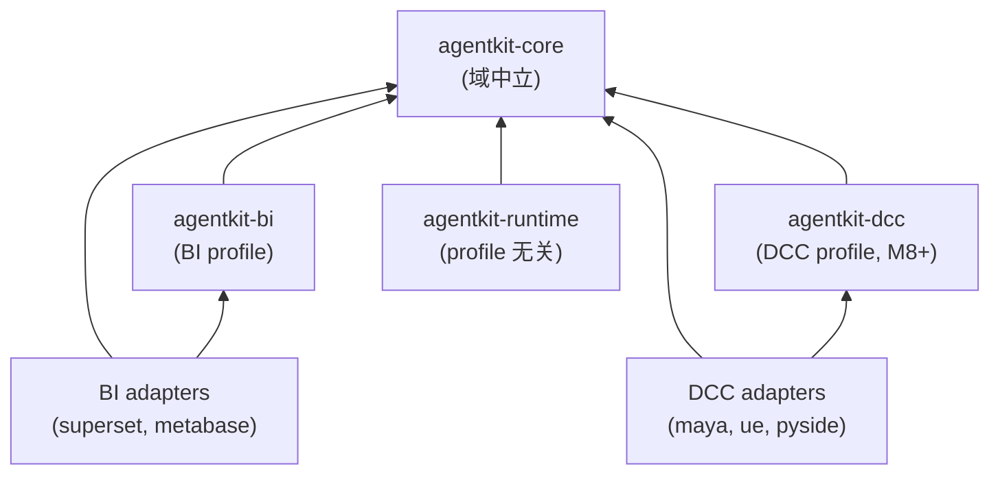

- runtime **profile 无关**(只依赖 core);领域 prompt/schema 处理由 profile 注入。
- BI 适配器依赖 core + `agentkit-bi`;DCC 适配器依赖 core + `agentkit-dcc`。
- profile 之间互不依赖(BI 与 DCC 平行)。

### D.6 收益与风险

- **收益**:M8 接 DCC 时 core 零改动(只写 `agentkit-dcc` + DCC 适配器);core 真正可复用于任何"组件驱动"领域。
- **风险**:泛化 `Component`/`ComponentSchema` 在没有真实 DCC 适配器前是推测性抽象。
- **缓解**:`ComponentSchema` 做成多态信封(core 不解析内容),而非硬抽象;profile 自由演进 schema 不动 core。M3(Superset)与 M8(Maya)两个真实适配器验证信封设计。

---

*本文档为架构草案,随里程碑实现迭代更新。两个窄腰的契约为强约束,变更需升版本号并更新本文档。*
